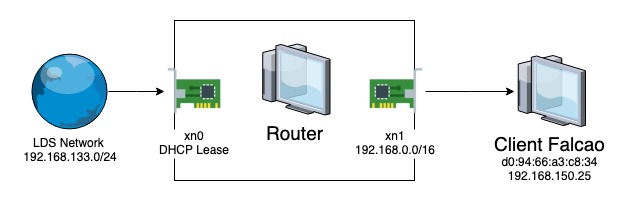

# NAT
Basic NAT config with FreeBSD

## Test computer (Border NAT)
```
$ dmesg | less: 
FreeBSD 8.0-STABLE-201004 #0: Mon Apr 5 15:59:06 UTC 2010 
CPU: Intel(R) Pentium(R) 4 CPU 3.20GHz (3200.01-MHz K8-class CPU) 
real memory = 536870912 (512 MB) 
age0: mem 0xfeac0000-0xfeafffff irq 17 at device 0.0 on pci2 
rl0: port 0xe800-0xe8ff mem 0xfebffc00-0xfebffcff irq 19 at device 0.0 on pci4 
```
## Router 
Up to date with the latest security advisories
```
# freebsd-update fetch
# freebsd-update install
```
Update packages
```
# pkg upgrade
```
Install dependencies
```
# pkg install iperf netstat
```

## Scheme



IP Pool for nat is `192.168.133.0/24`

DNS Server: `192.168.133.1`

LAN network `192.168.0.0/16`

LAN Range `192.168.150.50` -> `192.168.200.254`

`xn0` - external interface (WAN)

`xn1` - internal interface (LAN)


## Config NAT

### FreeBSD Network Configuration

Open /etc/rc.conf in your favorite editor. You need to add a line for each network card present on the system, for example in our case we'll use two network cards:

The NAT function is in pf (packet filter). To use pf, add the following lines to `/etc/rc.conf`:
```conf
# /etc/rc.conf 

# Hostname
hostname="freebsd"

# WAN connection
ifconfig_xn0="DHCP"

# LAN connection
ifconfig_xn1="inet 192.168.150.1 netmask 255.255.0.0"

# Default gateway
defaultrouter="192.168.133.1" # Set the gateway

# Enable ip forward
gateway_enable="YES"

dhcpd_enable="YES"
dhcpd_ifaces="xn1" # LAN card

pf_enable="YES"                           # Enable PF (load module if required)
pf_rules="/etc/pf.conf"                   # rules definition file for pf
pf_flags=""                               # additional flags for pfctl startup
pflog_enable="YES"                        # start pflogd(8)
pflog_logfile="/var/log/pflog"            # where pflogd should store the logfile
pflog_flags=""                            # additional flags for pflogd startup
pflogd_enable="YES"
pfsync_enable="YES"


```
You have to replace xn0, xn1 with the correct device for your cards, and the addresses with the proper ones.
defaultrouter is needed only if you are not using dhpc for WAN connection.

> NOTE: If you configured the network during installation, some lines about the network cards may be already present. Double check /etc/rc.conf before adding any lines.


You will also have to edit `/etc/hosts` to add the names and the IP addresses of various machines of the LAN, if they are not already there.

```
127.0.0.1        localhost
192.168.150.1    freebsdrouter
```

Set the DNS in `/etc/resolv.conf` :
```
nameserver    192.168.133.1
```

> NOTE: You need to manually set up the nameserver only if you are not using dhcp for WAN connection.

### Set up DHCP Server
The Dynamic Host Configuration Protocol (DHCP) is a network protocol used by hosts (DHCP clients) to retrieve IP address assignments and other configuration information. Each computer connected to a network must have a unique IP, and without DHCP TCP/IP information must be assigned manually on each computer. DHCP Server (or DHCPd) is the server that provides the DHCP client the information it needed.

To install DHCP Server, execute the following commands:
```
# cd /usr/ports/net/isc-dhcp3-server
# make install clean
```

Then edit /usr/local/etc/dhcpd.conf. (local DNS server,lease time, the network gateway, and the available IP address range).
```conf
# /usr/local/etc/dhcpd.conf

# name server
option domain-name-servers 192.168.133.1;
# lease time
default-lease-time 600;
max-lease-time 7200;

# If this DHCP server is the official DHCP server for the local
# network, the authoritative directive should be uncommented.
authoritative;

# Fixed IP address for falcao host using mac address.
host falcao {
    hardware ethernet d0:94:66:a3:c8:34;
    fixed-address 192.168.150.25;
}

# ad-hoc DNS update scheme - set to "none" to disable dynamic DNS updates.
ddns-update-style none;

# Use this to send dhcp log messages to a different log file
# you also have to hack syslog.conf to complete the redirection
log-facility local7;

# subnet declaration
subnet 192.168.0.0 netmask 255.255.0.0 {
range 192.168.150.50 192.168.200.254;
option routers 192.168.150.1;
option subnet-mask 255.255.0.0;
}
```


### Set up FreeBSD Firewall using OpenBSD's PF packet filter

A firewall (in this context) is a set of rules that allows or denies certain types of network packets from entering or leaving your FreeBSD router. This section deals with building a firewall.

We'll used one of the example PF configuration files ` /usr/share/examples/pf/faq-example1` as a basis for our configuration.
This sample file has everything we need for a basic FreeBSD router.
```
# /etc/pf.conf
### pf.conf
### macross
## internal and external interfaces
int_if = "xn1"
ext_if = "xn0"
int_addr = "192.168.150.1"             # Internal IPv4 address (i.e., gateway for private network)
int_network = "192.168.0.0/16"         # Internal IPv4 networkqi

# Ports we want to allow access to from the outside world on our local system (ext_if)
tcp_services = "{ 22, 80 }"

# ping requests
icmp_types = "echoreq"

# Private networks, we are going to block incoming traffic from them
priv_nets = "{ 127.0.0.0/8, 192.168.0.0/16, 172.16.0.0/12, 10.0.0.0/8 }"

### options
set block-policy drop
set loginterface $ext_if
set skip on lo0

### Scrub
scrub in all

# NAT traffic from internal network to external network through external interface
nat on $ext_if from $int_if:network to any -> ($ext_if)

### Filters ###
# Permit keep-state packets for UDP and TCP on external interfaces
pass out quick on $ext_if proto udp all keep state
pass out quick on $ext_if proto tcp all modulate state flags S/SA

# Permit any packets from internal network to this host
pass in quick on $int_if inet from $int_network to $int_addr

# Permit established sessions from internal network to any (incl. the Internet)
pass in quick on $int_if inet from $int_network to any keep state
# If you want to limit the number of sessions per NAT, nodes per NAT (simultaneously), and sessions per source IP
#pass in quick on $int_if inet from $int_network to any keep state (max 30000, source-track rule, max-src-nodes 100, max-src-states 500 )

# Permit and log all packets from clients in private network through NAT
pass in quick log on $int_if all

# Pass any other packets
pass in all
pass out all
```

Note that this file also defines filter rules which is useful or mandatory to provide the network to users. Eliminate filter section just by this part:
```
pass in all
pass out all
```

Here, we note that file `/var/log/pflog` would be automatically created as follows.
```
# ls -l /var/log/pflog
-rw-------  1 root  wheel  3832 Jul 13 17:45 /var/log/pflog
```

## Netstat check
#### xn0
```
# netstat -w1d -I xn0: 
                    input (age0) output 
packets     errs     idrops    bytes      packets        errs    bytes    colls 
5247          0         0       7332276   1600          0     83700      0 
5286          0         0       7331330   1578          0     82296      0 
5278          0         0       7339278   1589          0     83754      0 
5312          0         0       7380344   1570          0     82728      0 
5328          0         0       7337764   1567          0     83160      0 
```
#### xn1
```
# netstat -w1d -I xn1: 
                 input (rl0) output 
packets     errs    idrops     bytes     packets      errs       bytes     colls 
1556          0       0            93508    5133        0       7275788   0 
1547          0       0            92832    5169        0       7337174   0 
1551          0       0            93072    5161        0       7321088   0 
1539          0       0            92352    5199        0       7381268   0 
1520          0       0            91212    5195        0       7367642   0 
```

## Router Status
```
# top –S: 
last pid: 6320; load averages: 0.07, 0.02, 0.00 up 1+18:19:20 10:08:26 
70 processes: 3 running, 55 sleeping, 12 waiting 
CPU: 0.0% user, 0.0% nice, 1.2% system, 4.7% interrupt, 94.2% idle 
Mem: 21M Active, 136M Inact, 89M Wired, 44K Cache, 59M Buf, 237M Free 
Swap: 2048M Total, 2048M Free 
```

## Testing the connection

- Try to navigate the web using the connected device
- Check the kernel IP routing table using the command `netstat -r`
- Use the command `ip addr` if your ip is correctly inside the given NAT range
- You can TCP Dump the router (FreeBSD) while making network requests with the device

## Restrictions

- The security of the network configuration is low considering that all the ports are open and responsive, a setup we used for debug only and should not be a production solution
- Managing hosts who receive static IPs is too manual with the need of opening the configuration file and rebooting the system every time
- No wireless management is guaranteed since no access point was made available for testing
